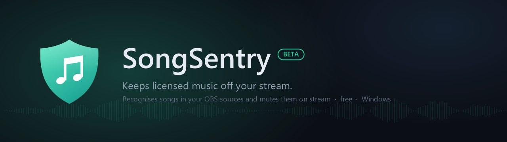
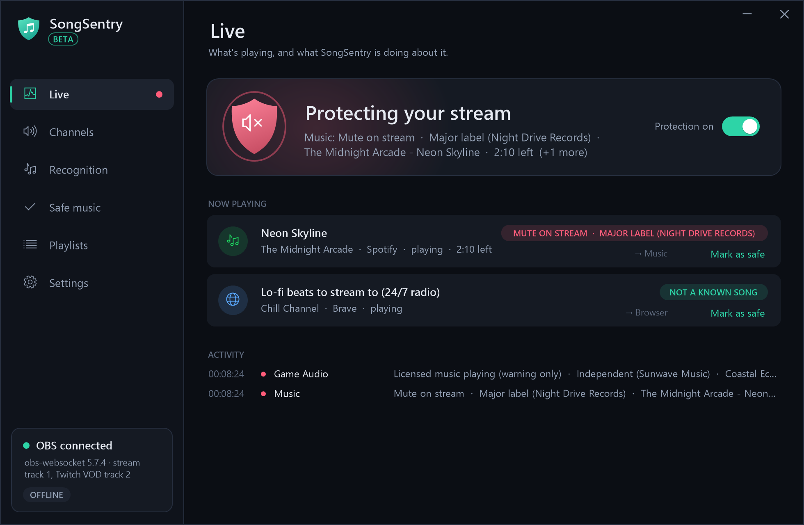
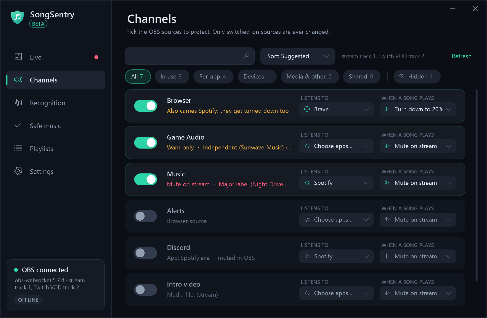
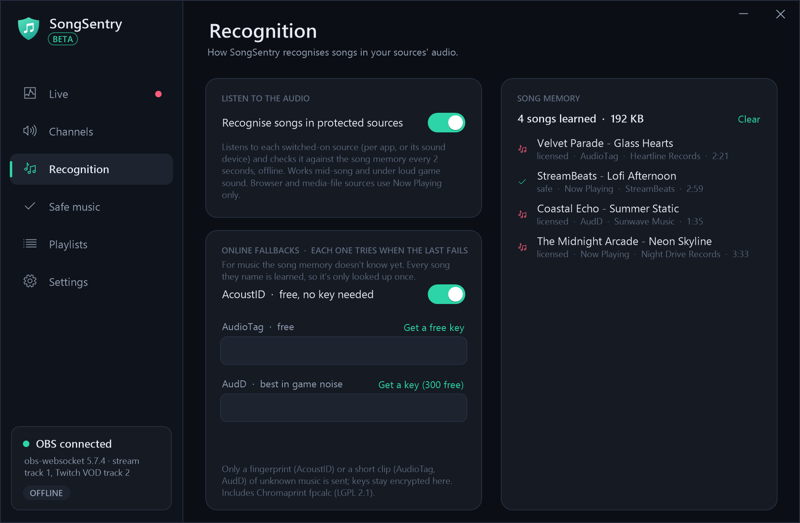
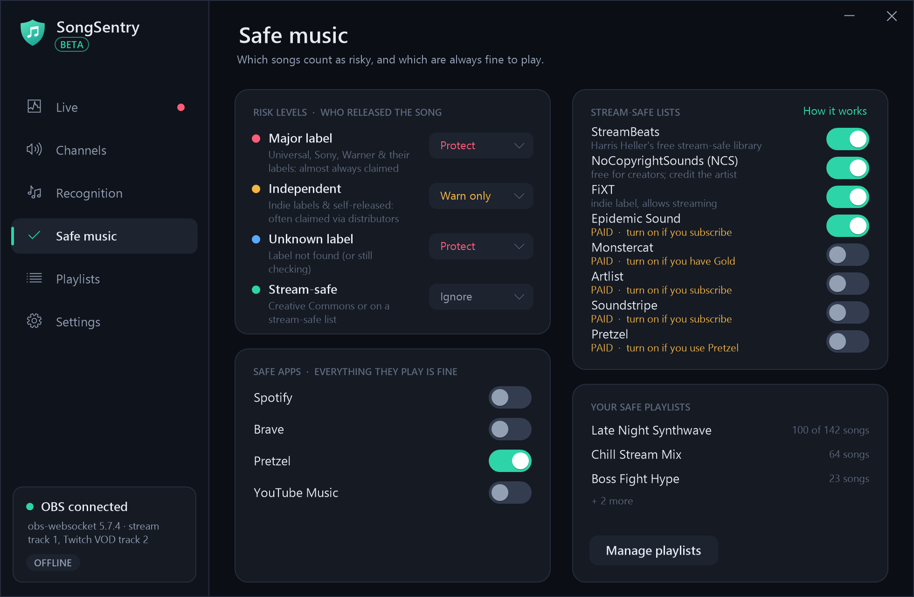
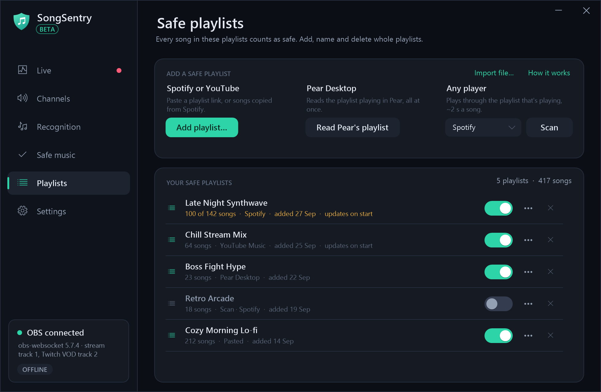
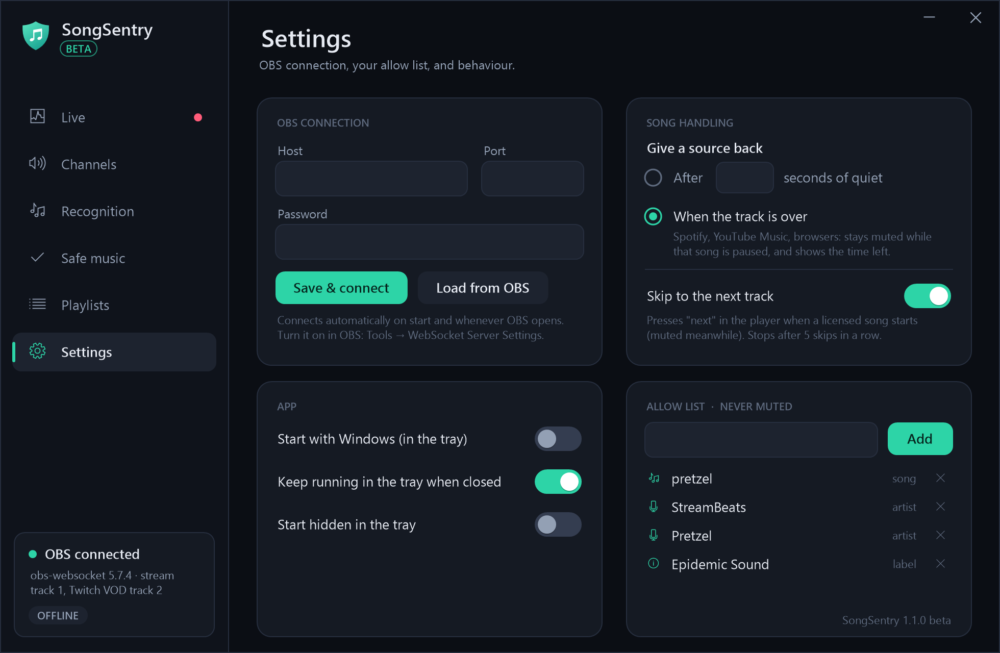
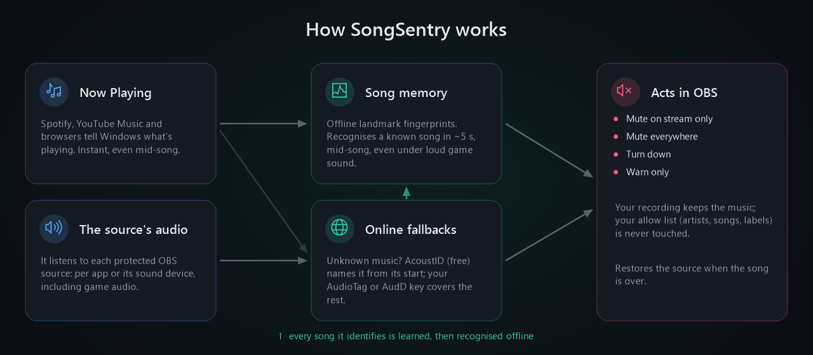

<p align="center">
  
</p>

<p align="center">
  <a href="https://github.com/Jayconius/SongSentry/releases/latest"></a>
  
  
  
  
  <a href="LICENSE"></a>
</p>

<p align="center">
  <b><a href="https://github.com/Jayconius/SongSentry/releases/latest">⬇ Download SongSentry 1.1.0 Beta</a></b>
</p>

---

**SongSentry** watches the music on your stream and, when a licensed song plays, tells **OBS** to mute that
source **on the stream only**, so your recording keeps it. When the song is over, it puts everything back
exactly as it was.

It knows what's playing in two ways. Media players tell Windows the song (Spotify, YouTube Music, browsers).
SongSentry also listens to the actual audio of each OBS source you protect, including game audio. Every song it identifies is
**learned into a local song memory**, so from then on it's recognized **offline, from the middle of the song,
even under loud game sound**.

It's free, it's a single ~4 MB exe with nothing to install, and it runs quietly in your tray using **about 40 MB of RAM**
(less than a single browser tab) and under 2 % of one CPU core, so it won't cost your stream or game any performance.

### Made for every kind of streamer

| | |
|---|---|
| 🎮 **Game streamers** | Licensed songs in game radios, emotes, lobbies and events are muted on stream while your game sound stays on. |
| 🦊 **VTubers** | Karaoke breaks, BGM and music in your model or overlay setup get protected. SongSentry doesn't touch your avatar or scenes, only the audio sources you choose. |
| 🚶 **IRL streamers** | Music from the laptop or phone mix feeding OBS, and background songs from your music app, get caught and muted on stream. |
| 🎙️ **Show hosts & podcasters** | Intros, bumpers and "let's listen to this" moments: play music for yourself while it's kept off the broadcast. |
| 🎧 **Just Chatting, art & music creators** | Background playlists on Spotify, YouTube Music or a browser, with one click to mark your own or stream-safe music as safe. |

If it goes through OBS, SongSentry can guard it.

> [!IMPORTANT]
> **Beta.** SongSentry **reduces** the risk of DMCA mutes and strikes; it can't guarantee zero. Nobody outside Twitch
> and YouTube can see their private copyright databases, and no recognizer knows every song (brand-new releases,
> remixes and most in-game soundtracks are hard). Keep using stream-safe music where you can.

## Screenshots

| Live | Channels |
|---|---|
|  |  |
| **Recognition** | **Safe music** |
|  |  |
| **Playlists** | **Settings** |
|  |  |

<sub>Screenshots use made-up sources and songs.</sub>

## How it works

<p align="center"></p>

1. **Now Playing (instant).** Spotify, YouTube Music, browsers and most media apps report the current track to
   Windows (the same info as the volume flyout). SongSentry reacts **before the first second** reaches your stream.
   Browser titles are first checked on **MusicBrainz**, so a stream or video title doesn't count as a song.
2. **Your sources' audio.** For each protected source, SongSentry captures exactly what that source carries: one
   app (like OBS's *Application Audio Capture*) or a sound device. Every 2 seconds it checks the last 5 seconds against
   its **song memory**, an offline "landmark" fingerprint index (the published technique behind Shazam-style
   recognition, written from scratch for SongSentry).
3. **Online fallbacks** for music the song memory doesn't know yet, each one trying when the one before fails:
   **AcoustID** (free, no key: names a song from its first ~18 seconds when SongSentry hears it start) →
   **AudioTag** → **AudD** (both optional, with *your own* free key; they also work mid-song).
4. **Learning.** Every song it identifies (from Now Playing or any of the services above) is learned at its real
   position in the song while it plays. Next time it's recognized offline in
   about 5 seconds, from any point in the song, even when the game is louder than the music.
5. **Deciding if it's risky.** Every recognized song is checked against your allow list, **safe apps** and
   **stream-safe lists**, then rated by **who released it** (MusicBrainz label and owner): *major label* (Universal,
   Sony, Warner), *independent*, *unknown*, or *stream-safe* (Creative Commons / stream-safe list). You choose what
   each level does: protect, warn only, or ignore.
6. **Acting in OBS** (via the built-in obs-websocket): **mute on stream only** (removes the source from your stream
   and Twitch VOD tracks and keeps it in your recording), **mute everywhere**, **turn down**, or **warn only**. It
   restores the original state afterwards, never unmutes something *you* muted, and backs off if you change a source
   by hand.

### How well it recognizes songs (tested)

Mid-song clips with real battle audio from a game mixed in:

| Game sound vs. music | Song memory (offline) | AcoustID (free, song start*) | AudD (optional key) | AudioTag (optional key) |
|---|:---:|:---:|:---:|:---:|
| Music only | ✅ 10/10, in ~5 s | ✅ | ✅ | ✅ |
| Music 6 dB louder | ✅ 10/10 | ✅ | ✅ | ✅ (weak) |
| Equally loud | ✅ 10/10 | ❌ | ✅ | ❌ |
| Game 6 dB louder | ✅ 9/10 | ❌ | ❌ | ❌ |
| Game 9 dB louder | ✅ 8/10 | ❌ | ❌ | ❌ |
| False alarms on game audio, speech & radio chatter | **0** in 321 checks | 0 | 0 | 0 |

<sub>* AcoustID only recognizes a song from its beginning (tested live: named the song ~18 s after it started, in
0.6 s). The others work from anywhere in the song.</sub>

The song memory only knows songs it has learned. That's why the online keys are useful for music you haven't played
before, and why it gets better the more you stream.

## Features

- 🎚️ **Channels.** Pick the OBS sources to protect. Search, filters (in use, per-app, devices, media, shared), hide
  what you don't need. Only switched-on sources are ever changed.
- 🎧 **Several apps per source**, auto-detected: SongSentry asks Windows which apps play through a device and pre-ticks them.
  Shared sources get a warning, because muting them silences the other apps too.
- 🔇 **Actions:** mute on stream only · mute everywhere · turn down to 5–50 % · warn only.
- ⏭️ **Skip to the next track** automatically (Spotify, YouTube Music, browsers), with a safety stop after 5 skips in a row.
- ⏱️ **Give the source back** after N seconds of quiet, or **when the track is over** (shows the time left).
- 🏷️ **Risk levels:** major label / independent / unknown / stream-safe, from MusicBrainz label and owner data
  (e.g. *Republic Records → Universal*). Pick protect, warn only or ignore for each level.
- 📚 **Stream-safe lists** built in (StreamBeats, NCS, FiXT), and switches for libraries you pay for (Epidemic Sound,
  Monstercat, Artlist, Soundstripe, Pretzel). No login: the switch means "I have a license".
- 🎶 **Safe playlists**, named and kept together, so you can switch off or delete a whole playlist at once. Add them by
  pasting a **Spotify or YouTube / YouTube Music playlist link**, by pasting **songs copied from Spotify** (big or
  private playlists, Liked Songs), from **Pear Desktop** in one click, or by scanning the playlist that's playing in
  any player. Links are checked for new songs each time SongSentry starts. No accounts or API keys.
- 🟢 **Safe apps:** everything a chosen app plays (e.g. Pretzel) counts as safe.
- ✅ **Allow list** of artists, songs and **record labels** (e.g. `label: Epidemic Sound`). One-click **Mark as safe**.
- 🧠 **Song memory**, offline and growing, ~32 KB per minute of music.
- 🌐 **Online fallbacks:** AcoustID (free, no key) → AudioTag → AudD (your own keys), each tried when the one before fails.
- 🛡️ **Safe by design:** restores everything on quit, a crash journal puts sources back after a crash,
  "Pause protection" in the tray, and no admin rights needed.
- 🪶 **Lightweight:** about **40 MB of RAM** and under 2 % of one CPU core while protecting, listening and learning.
  The song memory on disk is ~32 KB per minute of music.
- 🪟 Tray app, starts with Windows (optional), reconnects to OBS by itself.

## Getting started

1. **Download** `SongSentry.exe` from the [latest release](https://github.com/Jayconius/SongSentry/releases/latest)
   and run it. There's no installer. Windows may show *"Windows protected your PC"* because the exe isn't signed: click
   **More info → Run anyway**.
2. In OBS: **Tools → WebSocket Server Settings → Enable WebSocket server**. Copy the password (Show Connect Info).
3. In SongSentry: **Settings → OBS connection**, paste the password and click **Save & connect**
   (or **Load from OBS**).
4. **Channels:** switch on the sources that can carry music, and check **Listens to** (for example *Music → Spotify*).
5. Play a song. The Live page turns red and, in OBS, the source loses its stream track while the song plays.

**Tip:** give music apps their own OBS source (*Application Audio Capture → Spotify.exe*). Then SongSentry can mute
the music without muting your game or your friends.

## Requirements

- Windows 10 version 2004 or newer, or Windows 11 (per-app audio capture needs 2004+)
- OBS Studio 28 or newer (obs-websocket v5 is built in)
- .NET Framework 4.8, which is already part of Windows 10 1903+ and 11

## Privacy

Everything runs on your PC. SongSentry sends:
- **artist and song titles** to MusicBrainz, to check "is this a real song?" (browsers) and who released it (risk
  level, once per song, cached)
- **an audio fingerprint** (not audio) of the first ~18 s of unrecognized music to AcoustID, when it hears a song start
  (can be turned off on the Recognition page)
- **short audio clips (10–13 s) of unrecognized music** to AudioTag or AudD, **only if you add your own key**,
  at most one every 30 s per source.

Nothing else leaves your PC: no accounts, no telemetry. Settings, keys (encrypted with Windows DPAPI), the song memory
and a small log (passwords and tokens are removed from it) live in `%LocalAppData%\SongSentry`.

## FAQ

<details><summary><b>Does this guarantee I won't get DMCA'd?</b></summary>

No. It lowers the risk a lot for songs it recognizes, but nobody can see Twitch's or YouTube's private databases,
and some music (brand-new releases, many remixes, most game soundtracks) isn't known to any recognizer. Detection
from audio also needs about 5 seconds; Now Playing sources are instant.
</details>

<details><summary><b>How does it know a song is copyrighted?</b></summary>

Nobody outside Twitch and YouTube can see their private databases, so SongSentry estimates it from public data. A
recognized song is treated as risky unless it's on your allow list, a stream-safe list or from a safe app. Then who
released it decides: major labels are almost always claimed, independent releases often are (distributors register
them too), and Creative Commons or stream-safe library music is fine. You set what each level does on the
**Safe music** page.
</details>

<details><summary><b>Can I whitelist my stream-safe playlist?</b></summary>

Yes, on the **Playlists** page. Every song in a saved playlist counts as safe, and you can rename, switch off or
delete a playlist as a whole.

- **YouTube / YouTube Music:** paste the playlist's Share link. The whole playlist is read in seconds (public or
  unlisted playlists).
- **Spotify:** paste the playlist's Share link. Spotify only shares the first 100 songs of public playlists that way.
  For bigger or private playlists (or Liked Songs), open the playlist in the Spotify app, click a song, press
  **Ctrl+A** then **Ctrl+C**, and paste: every song is read, about a minute for 600 songs.
- **Pear Desktop** (YouTube Music): play the playlist and click **Read Pear's playlist**. It needs Pear's API Server
  plugin, and Pear asks you once.
- **Any other player:** **Scan** presses "next" every ~2 seconds and saves each song until the playlist starts over.

If SongSentry can't read a playlist's name, it asks you for one. You can also import a text or CSV file
(for example an Exportify export).
</details>

<details><summary><b>Windows says "Windows protected your PC".</b></summary>

The exe isn't code-signed (certificates are expensive for a free beta). Click **More info → Run anyway**. You can
also build it yourself from this source (see below).
</details>

<details><summary><b>My whole desktop audio is one source. What happens?</b></summary>

Muting it silences everything, game and voice chat included. SongSentry warns you about this ("Shared" filter). The better
setup is one *Application Audio Capture* source per app (Spotify, the game, the browser).
</details>

<details><summary><b>What about Fortnite, GTA V and other games?</b></summary>

Game audio can be protected like any other source, and SongSentry recognizes songs it has learned. For example, it
identified a GTA V radio song in testing. Fortnite also has its own **Settings → Audio → Creator Options → Licensed
Audio** toggle, which is worth turning on. A game's own soundtrack or jingles may be flagged as music. Mark them as
safe once.
</details>

<details><summary><b>Why do I need my own AudioTag / AudD key?</b></summary>

You don't have to. AcoustID is built in and free, but it only recognizes a song from its start. AudioTag and AudD
also work mid-song. Online recognition costs money to run, so they need a key per person: AudioTag gives about 1.5
hours of audio per month free, and AudD 300 requests. A key shared by everyone would run out in a day.
</details>

<details><summary><b>Does it use a lot of RAM or CPU?</b></summary>

No. Capturing audio costs almost nothing, and a song-memory check takes about 7 ms every 2 seconds per source.
In testing the whole app used about 1.7 % of one CPU core and ~40 MB of RAM while protecting, listening to and learning a playing song.
</details>

<details><summary><b>How do I uninstall it?</b></summary>

Quit it from the tray (this restores all sources), delete `SongSentry.exe` and the folder
`%LocalAppData%\SongSentry`. If you enabled *Start with Windows*, turn it off first (or remove the `SongSentry`
entry from Task Manager → Startup apps).
</details>

## Build from source

No SDK or Visual Studio needed. It uses the C# compiler that ships with Windows:

```powershell
powershell -ExecutionPolicy Bypass -File build.ps1
```

This runs the logic tests (59 checks against a fake OBS), renders the icon, screenshots and graphics, and builds
`dist\SongSentry.exe`.

## Roadmap

SongSentry is a **beta** made by one streamer for streamers. **If this project gets traction, it will be developed
further.** Stars, issues and feedback are what decide that. Ideas on the list:

- A song log (what played, when, which label) and chat/stream-marker integration
- Now Playing sources learned automatically from your playlists
- A "music detected" safety net that turns down unknown music
- Import your own music files as "safe"
- More languages, and a signed installer

Found a bug or have an idea? [Open an issue](https://github.com/Jayconius/SongSentry/issues).

## Credits

- [AcoustID](https://acoustid.org) and [Chromaprint](https://github.com/acoustid/chromaprint) (bundled `fpcalc`, LGPL 2.1, see [THIRD_PARTY_NOTICES.md](THIRD_PARTY_NOTICES.md))
- [MusicBrainz](https://musicbrainz.org) for song data · [AudioTag.info](https://audiotag.info) and [AudD](https://audd.io) (optional)
- [obs-websocket](https://github.com/obsproject/obs-websocket), built into OBS Studio
- Landmark fingerprinting after A. Wang, *"An Industrial-Strength Audio Search Algorithm"* (2003)

## License

[MIT](LICENSE) © 2026 Jayconius. The bundled Chromaprint `fpcalc` is LGPL 2.1; see [THIRD_PARTY_NOTICES.md](THIRD_PARTY_NOTICES.md).

SongSentry is an independent project and is **not affiliated with** OBS, Twitch, YouTube, Spotify, AcoustID, AudD, AudioTag,
MusicBrainz or any record label. All trademarks belong to their owners.

---

<p align="center"><sub>🤖 Made with <a href="https://claude.com/claude-code">Claude</a>: designed and written together with Claude, Anthropic's AI, in Claude Code.</sub></p>
